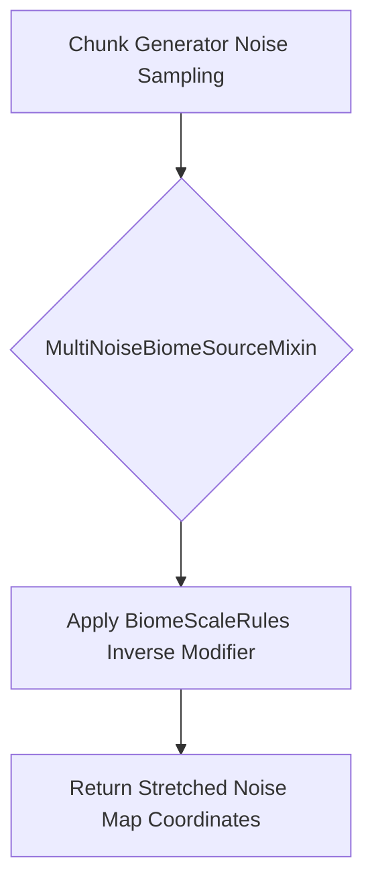

# Biome Scale Architecture

## System Overview

## Module Responsibilities

- **BiomeScaleRules**: Registers the GameRule and caches the modifier on tick.
- **MultiNoiseBiomeSourceMixin**: Intercepts `getNoiseBiome` coordinate arguments to modify `x` and `z`.

## Design Decisions

- Hooked directly into `MultiNoiseBiomeSource` arguments to preserve vanilla noise blending without modifying actual chunk generation logic.
